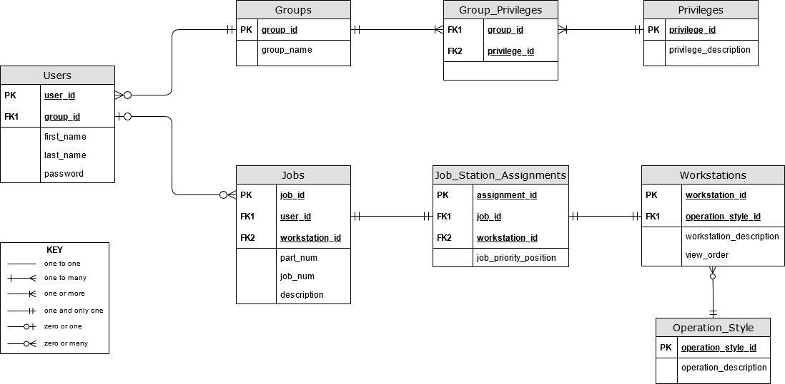
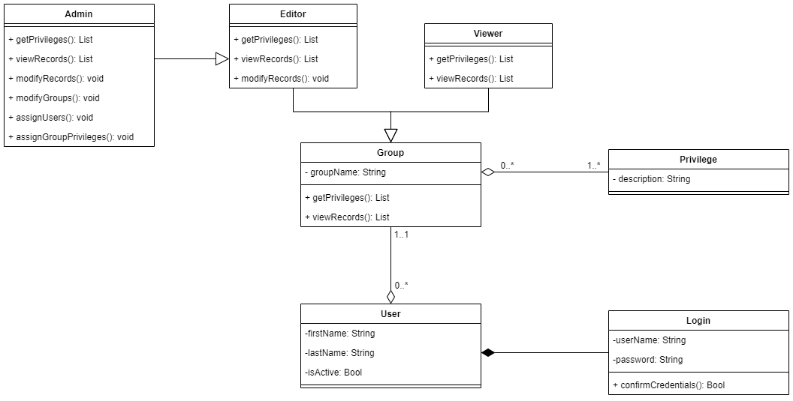

# Phase 1-00: Authorization

*The authorization phase defines the role-based hierarchy of the rest of the application. Users of the app will be granted different privileges dependent upon the privilege group to which they are assigned. All users, with the exception of basic Viewer's will access the application through a standard Login screen.*

## Entity-Relationship Diagram

## UML Class Diagram

